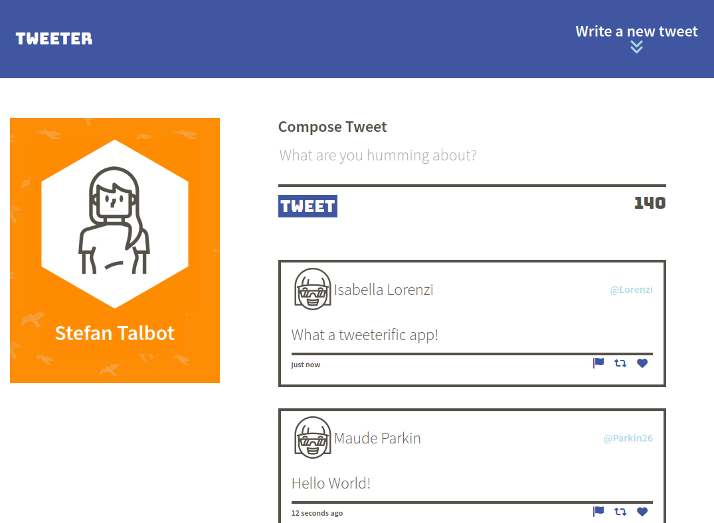
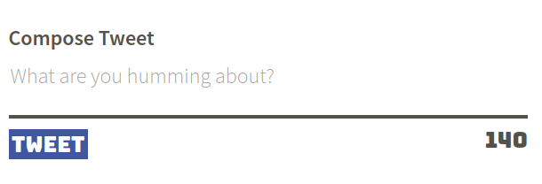
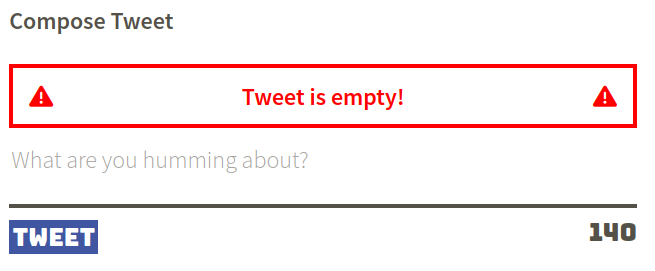
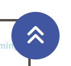

<!-- PROJECT LOGO -->
<div align="center">

# TWEETER

<div align="center">
  A single page twitter clone, where users can write and share short messages.
  <div>
    <a href="https://github.com/TeaBizzy/tweeter/issues">Report Bug</a>
    ·
    <a href="https://github.com/TeaBizzy/tweeter/issues">Request Feature</a>
  </div>
</div>
<br />

<!-- ABOUT THE PROJECT -->
## About The Project



---
### Built With

<a href="https://expressjs.com/">Express</a> : 
<a href="https://sass-lang.com/">Sass</a> : 
<a href="https://jquery.com/">jQuery</a>

<div align="left">

---

<!-- GETTING STARTED -->
## Getting Started

### Prerequisites

* npm
* node

### Installation

1. Clone the repo
   ```sh
   git clone https://github.com/teabizzy/tweeter.git
   ```
2. Install NPM packages
   ```sh
   npm install
   ```

### Accessing the Website

1. Start the server
   ```sh
   npm run local
   ```
2. Open your browser, and enter the following url
   ```
   http://localhost:8080/
   ```

---
<!-- USAGE EXAMPLES -->
## Usage

### Compose Tweet
* Compose a tweet of 1-140 characters long, and click 'tweet' to submit!

  

* If a tweet is invalid an error will appear.

  

---

### Show / Hide Tweet Form

* This button on the right side of the nav bar will toggle the new tweet form.

  

---

### Return To Top

* After scrolling away from the top of the page, this button will appear on the bottom right.

  

* Clicking this will send you back to the top of the page.

---

<!-- CONTACT -->
## Contact

Stefan Talbot - satalbot@protonmail.com

Project Link: [https://github.com/TeaBizzy/tweeter](https://github.com/TeaBizzy/tweeter)

---

<!-- ACKNOWLEDGMENTS -->
## Acknowledgments

* [Light House Labs](https://www.lighthouselabs.ca/)